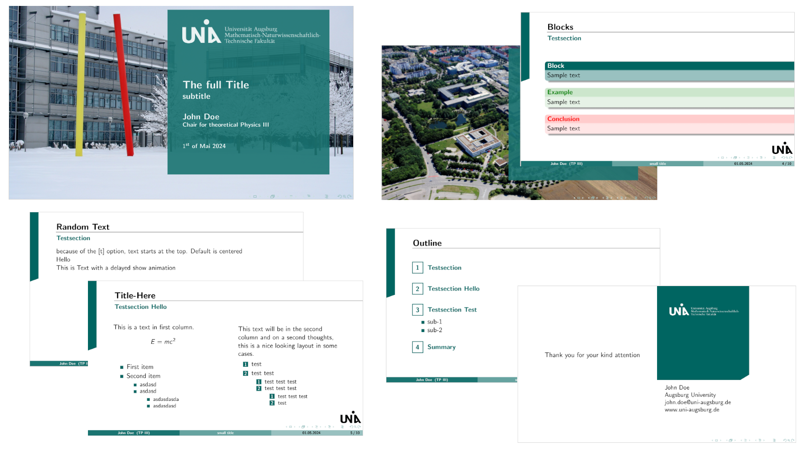
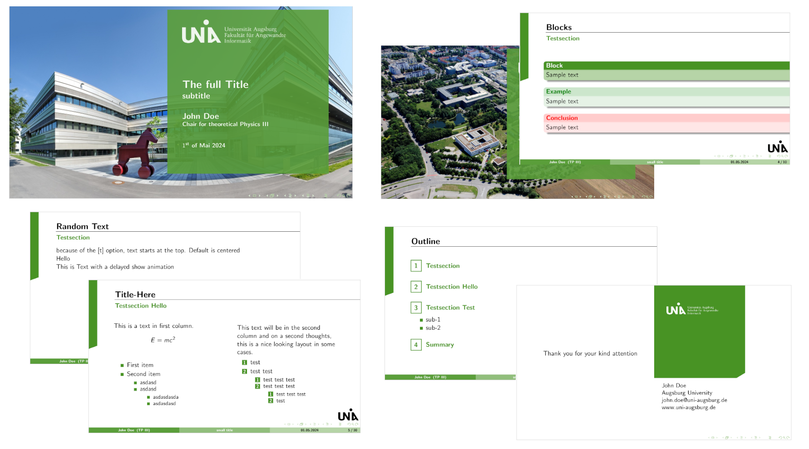

# Beamer Theme: uniamntf

A theme for the [LaTeX](https://www.latex-project.org/) package [beamer](https://github.com/josephwright/beamer) that replicates the look of the Powerpoint-Presentation template published by and for the University of Augsburg.

The template attempts to provide the basics features that the author needed to properly replicate the look of [This presentation template](https://v2-powerpoint.de/portfolio-item/universitaet-augsburg/) used by the University of Augsburg.

<table>
<tr>
<td>

### MNTF-Theme

</td>
<td>

### FAI-Theme

</td>
</tr>
</table>

## Usage

Replicate the `example-presentation.tex` and adapt to your needs.

LaTeX must be able to find the `.sty` files. This could be achieved by placing them right next to your main `.tex`-file.

The images must be located at the correct place. This could be achieved by placing the `slide-background-images`-folder right next to your main `.tex`-file.

## License

The images in the folder `slide-background-images` are not owned by the author of the template, but by the University of Augsburg.

Providing them here in this repository under the GPL license is assumed to be allowed.

As [per Wikipedia](https://de.wikipedia.org/wiki/Datei:Logo_uni_augsburg.jpg), the logos may be distributed under GPL license (checked on 08.04.2024).

The background image is taken from the [Presentation Master Template](https://v2-powerpoint.de/portfolio-item/universitaet-augsburg/) (checked on 08.04.2024).
These were publicly available for all faculties on the website at some point which is where/when I downloaded them for personal use. However they are hard to find and download links move regularly especially with the transition to the new website.

All the presentation masters are currently available in their PowerPoint-Template form in the intranet of the University of Augsburg (checked on 10.04.2024). However the intranet login is extremely buggy and not even all students can log into it (or know that it exists). For the sake of usability by the students (which I assume is the prime directive of their [Corporate Design](https://www.designtagebuch.de/cd-manuals/uni-augsburg-richtlinien.pdf) (original also in the intranet)) and to unify the presentation style, it seems useful to create this as a resource that can be found publicly and not hide it behind layers of links.

If there are legal problems with the publishing of this content, please feel free to contact me to get this resolved.

## Thanks

If you found this useful, feel free to drop a message and or share among fellow students. If we know that this is well received, it could be publicly shared on the University of Augsburg web-page to be of help for more students.
